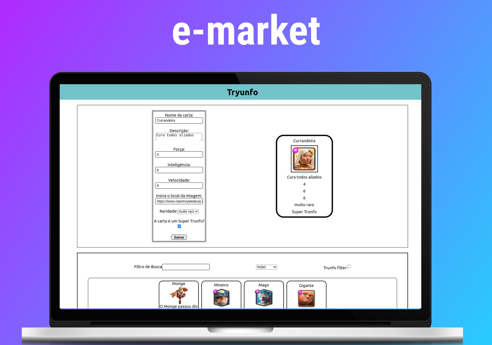

<h1 align="center"> Tryunfo </h1>

Projeto de manipulação de estado feito em React.
 
Em caso de dicas, observações ou ajuda você pode entrar em contato comigo por qualquer um dos meios disponibilazados na minha bio. 🙂❤️

  <a href="#-tecnologias">Tecnologias</a>&nbsp;&nbsp;&nbsp;|&nbsp;&nbsp;&nbsp;
  <a href="#-projeto">Projeto</a>&nbsp;&nbsp;&nbsp;|&nbsp;&nbsp;&nbsp;
  <a href="#-projeto">Habilidades</a>

 

<!-- ⚠️ Projeto passando por algumas alterações de CSS, em breve disponibilizo as mudanças. ⚠️ -->

  

## 🚀 Tecnologias

Esse projeto foi desenvolvido utilizando as seguintes tecnologias:

- JavaScript
- Git e Github
- ReatJs

## 🚀 Habilidades

Verifica a capacidade de:

- Ler o estado de um componente e usá-lo para alterar o que exibimos no browser
- Inicializar um componente, dando a ele um estado pré-definido
- Atualizar o estado de um componente
- Capturar eventos utilizando a sintaxe do React
- Transmitir informações de componentes filhos para componentes pais via callbacks

## 💻 Projeto

Tryunfo é uma aplicção React que simulará um jogo de Super Trunfo, onde será possível criar suas próprias cartas.

<h2 align="center">Feito com ♥ by ogabrielfef</h2>